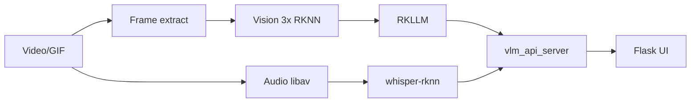

# video-descriptor-rkllm

[](https://github.com/ShiWarai/video-descriptor-rkllm/actions/workflows/deploy.yml)
[](LICENSE)


Описание видео/GIF на **RK3588 NPU**: Qwen3.5-VL (RKNN + RKLLM), декод кадров через **ffmpeg-rockchip** (libav), OpenAI-compatible API и Flask web UI.

## Быстрый старт

**Требования:** RK3588/S, Ubuntu 22.04/24 arm64, RKNPU2 (`/dev/mpp_service`, `/dev/rga`, `/dev/dri`, `/dev/dma_heap`), веса в `./models` или `VLM_DOWNLOAD_MODELS` в `.env`.

```bash
git clone https://github.com/ShiWarai/video-descriptor-rkllm.git && cd video-descriptor-rkllm
cp .env.example .env   # whisper, автоподгрузка моделей
docker compose up -d --build
```

- **API:** http://localhost:8080 — `/health`, `/ready`, `/v1/models`, `/v1/video/analyze`
- **Web UI:** http://localhost:5000

GHCR (prod / prerelease):

```bash
docker compose -f docker-compose.yml -f docker-compose.prod.yml pull && docker compose -f docker-compose.yml -f docker-compose.prod.yml up -d
docker compose -f docker-compose.yml -f docker-compose.prerelease.yml pull && docker compose -f docker-compose.yml -f docker-compose.prerelease.yml up -d
```

Образы: API `linux/arm64`, web `amd64+arm64` — `ghcr.io/shiwarai/video-descriptor-rkllm(:main|:prerelease)` и `-web`.

## Пайплайн



Параллельно: **кадры** (libav `h264_rkmpp` + `scale_rkrga` → RGB 448×448) + **аудио** (libav → WAV 16 kHz mono в RAM → whisper-rknn) + **vision encode** (3× RKNN) → multimodal LLM.

| Вход | ASR | Кадры |
|------|-----|-------|
| Видео | да ([whisper-rknn](https://github.com/ShiWarai/whisper-rknn), `WHISPER_RKNN_URL`) | rkmpp |
| GIF | `transcript.status=skipped` | software libav |

LLM ждёт ASR (`ok`/`provided`), вставляет речь в начало prompt. Метрики: `image_prep_ms` — wall подготовки картинок (модель + extract + vision, параллельно); `vision_encode_ms` — только RKNN после готовности модели; `frame_extract_ms` / `transcript_ms` — wall отдельных потоков (∥). В UI % только у последовательных этапов.

**Thinking:** `enable_thinking` в config/запросе (без `/think` в prompt). В `description` только финальный ответ (`stripThinkingTags`). При thinking нужно **512–1024+** `max_tokens`; отдельный sampling: `thinking_*` в config. **Промпты:** `simple` | `detailed` (`include/core/vision_prompts.hpp`).

## HTTP API

```bash
curl -s localhost:8080/health    # liveness (loading|idle|busy)
curl -s localhost:8080/ready     # readiness (503 пока грузятся модели)
```

При заданном `VLM_API_KEY` (или `api_key` в config) все `/v1/*` требуют заголовок `Authorization: Bearer <key>`. `/health` и `/ready` остаются без auth.

`POST /v1/video/analyze` (multipart): `file`, `model` (`qwen3.5-{0.8b,2b,4b}-video`), `frames`, `frame_budget`, `max_tokens`, `lang` (`ru`|`eng`), `prompt_mode`, `enable_thinking`, `temperature`, `transcript` (override ASR).

Ответ: `description`, `transcript` (`status`: `ok`|`stub`|`error`|`skipped`|`provided`), `metrics` (`wall_ms`, `image_prep_ms`, `vision_encode_ms`, …), `frames_used`.

```bash
curl -s localhost:8080/v1/video/analyze \
  -H "Authorization: Bearer $VLM_API_KEY" \
  -F file=@test.mp4 -F model=qwen3.5-0.8b-video -F frames=8 -F lang=ru | jq
```

Также: `POST /v1/chat/completions` с `video_url` + `extra_body`, `GET /v1/models`.

**k8s:** liveness `/health`, readiness `/ready` (startupProbe `failureThreshold: 60` при `VLM_DOWNLOAD_MODELS=all`).

## Конфигурация

Переменные — [`.env.example`](.env.example) (подхватывается compose). Ключевые:

| Переменная | Назначение |
|------------|------------|
| `WHISPER_RKNN_URL` | ASR; пусто = stub |
| `WHISPER_API_KEY` | Bearer для whisper-rknn `/transcribe`; пусто = без auth |
| `VLM_DOWNLOAD_MODELS` | `0`, `0.8b`, `2b`, `4b`, `all` |
| `VLM_API_KEY` | Bearer для `/v1/*`; пусто = без auth |
| `VLM_FIX_FREQ` | NPU+CPU+DDR max (`scripts/fix_freq_rk3588.sh`, нужен `privileged`) |
| `VLM_FIX_GPU_FREQ` | `0` = не трогать Mali GPU |

Серверный config — [`config.example.json`](config.example.json): модели, `api_key`, `pipeline.*`.

## Модели

Веса не в git → `./models`. Источник: [Qengineering на HF](https://huggingface.co/Qengineering).

| | Vision | LLM |
|--|--------|-----|
| 0.8B | `qwen3.5-0.8b_vision_rk3588.rknn` | `qwen3.5-0.8b_w8a8_rk3588.rkllm` |
| 2B | `qwen3.5-2b_vision_rk3588.rknn` | `qwen3.5-2b_w8a8_rk3588.rkllm` |
| 4B | `qwen3.5-4b_vision_rk3588.rknn` | `qwen3.5-4b_w8a8_rk3588.rkllm` |

```bash
MODELS_DIR=./models ./scripts/download_models.sh 0.8b   # или VLM_DOWNLOAD_MODELS в .env
```

## Сборка и тесты

```bash
mkdir -p build && cd build && cmake .. && make -j$(nproc) && ctest --output-on-failure
```

RPATH к `third_party/lib` и `ffmpeg-rockchip/lib` вшит в бинарники. Docker-тесты (как CI):

```bash
docker compose -f docker-compose.dev.yml build && docker compose -f docker-compose.dev.yml run --rm test
```

Артефакты: `build/vlm_api_server`, `build/VLM_VIDEO_NPU` (CLI не в runtime-образе).

```bash
./build/VLM_VIDEO_NPU models/*.rknn models/*.rkllm video.mp4 --frames 20 --verbose
./build/vlm_api_server --config config.json
```

## CI/CD

Push `main`/`dev` → `ctest` в Docker (`ubuntu-24.04-arm`). Prerelease: commit `[prerelease]` на `dev` или manual workflow. Telegram: secrets `TELEGRAM_TOKEN`, `TELEGRAM_TO` (опционально).

## Атрибуция

[Qengineering](https://github.com/Qengineering) · [nyanmisaka/ffmpeg-rockchip](https://github.com/nyanmisaka/ffmpeg-rockchip) · Rockchip RKLLM/RKNN

## Лицензия

BSD 3-Clause — [LICENSE](LICENSE)
