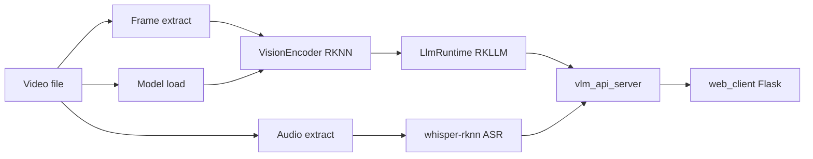

# video-descriptor-rkllm

[](https://github.com/ShiWarai/video-descriptor-rkllm/actions/workflows/deploy.yml)
[](LICENSE)


Описание видео на **Rockchip RK3588 NPU**: Qwen3.5-VL (RKNN + RKLLM), аппаратный декод через **ffmpeg-rockchip**, OpenAI-compatible HTTP API и Flask web UI.

## Оглавление

| Раздел | Содержание |
|--------|------------|
| [Быстрый старт](#быстрый-старт) | Docker Compose на RK3588 |
| [Требования](#требования) | Железо, драйверы, модели |
| [Архитектура](#архитектура) | Пайплайн video → API |
| [HTTP API](#http-api) | Эндпоинты, параметры, ответ |
| [CLI](#cli) | Локальный запуск |
| [Конфигурация](#конфигурация) | `.env`, `config.json` |
| [Модели](#модели) | HF, автоподгрузка |
| [Сборка из исходников](#сборка-из-исходников) | CMake, тесты |
| [CI/CD](#cicd) | GHCR `:main` / `:prerelease` |
| [Атрибуция](#атрибуция) | Upstream |
| [Лицензия](#лицензия) | BSD 3-Clause |

---

## Быстрый старт

На плате RK3588 (arm64):

```bash
git clone https://github.com/ShiWarai/video-descriptor-rkllm.git
cd video-descriptor-rkllm

cp .env.example .env
# Отредактируйте .env: whisper, автоподгрузка моделей и т.д.

# Положите веса в `./models` или включите автоподгрузку в .env:
# VLM_DOWNLOAD_MODELS=0.8b
docker compose up -d --build
```

- **API:** http://localhost:8080 (`/health`, `/ready`, `/v1/models`, `/v1/video/analyze`)
- **Web UI:** http://localhost:5000 — загрузка **видео или GIF**, описание, транскрипт, метрики (в строке «Итого» — токены/лимит)

Логи: `docker compose logs -f api` (или `web`). При `VLM_VERBOSE=1` в `.env` API печатает prompt и stream в stderr.

Продакшен (образы из GHCR): API **linux/arm64** (~224 MB), web **linux/amd64 + arm64** (~224 MB):

```bash
cp .env.example .env   # если ещё не создан
docker compose -f docker-compose.yml -f docker-compose.prod.yml pull
docker compose -f docker-compose.yml -f docker-compose.prod.yml up -d
```

Prerelease:

```bash
cp .env.example .env   # если ещё не создан
docker compose -f docker-compose.yml -f docker-compose.prerelease.yml pull
docker compose -f docker-compose.yml -f docker-compose.prerelease.yml up -d
```

---

## Требования

| Компонент | Версия / примечание |
|-----------|---------------------|
| SoC | Rockchip **RK3588 / RK3588S** |
| OS | Ubuntu 22.04 / 24.04 arm64 |
| NPU | RKNPU2 driver, устройства `/dev/mpp_service`, `/dev/rga`, `/dev/dri`, `/dev/dma_heap` |
| Runtime | RKLLM 1.3.0+, RKNN (в `third_party/lib`) |
| ffmpeg | vendored **ffmpeg-rockchip** (`third_party/ffmpeg-rockchip/`) — decode/resize/RGB на MPP+RGA |
| Модели | не в git — volume `./models` или `VLM_DOWNLOAD_MODELS` в `.env` |

---

## Архитектура



Сервис: видео/GIF → **параллельно** кадры (ffmpeg-rockchip) + (для видео) аудио → ASR ([whisper-rknn](https://github.com/ShiWarai/whisper-rknn)) + vision encoder (RKNN) → multimodal LLM (RKLLM) → **description** + **transcript**.

### Входные форматы

| Тип | ASR | Примечание |
|-----|-----|------------|
| Видео (mp4, mkv, …) | да | транскрипт в prompt и в ответе |
| **GIF** | **нет** | `transcript.status=skipped`; кадры через software ffmpeg (без rkmpp) |

ASR и vision encode идут параллельно. Для видео LLM **дожидается** ASR (если `status=ok` / `provided`) и вставляет речь **в начало prompt** (кадры + речь, затем задание). В ответе API транскрипт также возвращается отдельно.

### Thinking mode

Режим задаётся флагом RKLLM `RKLLMInput.enable_thinking` (`pipeline.enable_thinking` в config, `enable_thinking` в запросе / Web UI). Суффиксы `/think` и `/no_think` **не** добавляются в user prompt.

**Постобработка ответа** (`stripThinkingTags` в `src/core/text_util.cpp`):

| Что убирается | Как |
|---------------|-----|
| Блок reasoning | целиком, с содержимым: теги `<think>` или `<thinking>` |
| Soft-switches | `/think`, `/no_think` (если модель эхоит) |

В `description` попадает **только финальный ответ**. При `enable_thinking=true` модель может потратить весь `max_tokens` на reasoning — тогда описание будет пустым. Рекомендуется **512–1024+** токенов для thinking (в Web UI поле «Max tokens»).

Sampling для thinking задаётся отдельно: `thinking_temperature`, `thinking_top_p`, `thinking_presence_penalty` в `config.json`.

**Режимы промпта** (`prompt_mode`):

| Режим | Структура |
|-------|-----------|
| `simple` | «Тебе даны кадры… [с речью…]» → «Опиши кратко и по делу видео.» |
| `detailed` (по умолчанию в UI) | то же вступление → «Опиши это видео…» + пункты 1–3 (о чём / **текст в кадрах** / жанр) |

Тексты промптов — в `include/core/vision_prompts.hpp`; сборка через `LlmRuntime::buildUserVisionPrompt`.

**Whisper:** внешний [whisper-rknn](https://github.com/ShiWarai/whisper-rknn). URL задаётся в `.env` (`WHISPER_RKNN_URL`). Пусто — stub (`transcript.status=stub`).

**Метрики времени:** этапы `transcript_ms`, `frame_extract_ms`, `vision_encode_ms` и др. считаются **по отдельности** (wall каждого потока). В UI проценты от `wall_ms` могут суммироваться >100% — этапы частично идут **параллельно**, это нормально.

**Память при долгой работе:** после каждого запроса embeddings и буферы ответа освобождаются (`shrink_to_fit` + `malloc_trim`). В Docker задано `MALLOC_ARENA_MAX=2`, чтобы glibc не плодил лишние malloc-арены в многопоточном httplib (это не reload модели, только поведение аллокатора).

---

## HTTP API

### Статус

```bash
curl -s http://localhost:8080/health   # liveness: процесс жив (status=loading|idle|busy)
curl -s http://localhost:8080/ready    # readiness: 200 когда модели скачаны и сервис готов
curl -s http://localhost:8080/v1/status | jq
```

При `VLM_DOWNLOAD_MODELS` сервер поднимает HTTP сразу (`/health` → 200, `status: loading`), а скачивание весов идёт в фоне startup. `web` и k8s readiness ждут `/ready` (503 до окончания загрузки).

**k3s / Kubernetes probes:**

```yaml
livenessProbe:
  httpGet:
    path: /health
    port: 8080
  periodSeconds: 30
readinessProbe:
  httpGet:
    path: /ready
    port: 8080
  periodSeconds: 15
  failureThreshold: 40   # до ~10 мин на первую загрузку all
startupProbe:
  httpGet:
    path: /ready
    port: 8080
  periodSeconds: 15
  failureThreshold: 60   # до ~15 мин на первую загрузку all
```

### `POST /v1/video/analyze` (multipart)

Поля формы:

| Поле | По умолчанию | Описание |
|------|--------------|----------|
| `file` | — | Видео или GIF (обязательно) |
| `model` | из `config.json` | `qwen3.5-0.8b-video` / `qwen3.5-2b-video` / `qwen3.5-4b-video` |
| `frames` | 8 | Сколько кадров запросить |
| `frame_budget` | из config | Потолок кадров с учётом контекста |
| `max_tokens` | из config | Лимит генерации LLM |
| `lang` | `ru` | `ru` или `eng` (язык ответа) |
| `prompt_mode` | `detailed` | `simple` \| `detailed` |
| `enable_thinking` | из config | `true` / `false` / `1` / `0` — при `true` увеличьте `max_tokens` |
| `temperature` | из config | override sampling |
| `transcript` | — | готовый текст ASR (пропустить whisper) |

`transcript.status` в ответе: `ok` | `stub` | `error` | `skipped` (GIF) | `provided` (override).

```bash
curl -s http://localhost:8080/v1/video/analyze \
  -F "file=@test_video.mp4" \
  -F "model=qwen3.5-0.8b-video" \
  -F "frames=8" \
  -F "frame_budget=28" \
  -F "lang=ru" \
  -F "prompt_mode=detailed" | jq
```

Ответ (основные поля):

| Поле | Описание |
|------|----------|
| `description` | Текст описания от VLM (без блоков thinking) |
| `transcript` | `{ "text", "status" }` — ASR, stub, `skipped` (GIF) или override |
| `metrics` | `wall_ms`, `transcript_ms`, `vision_encode_ms`, `llm_generate_ms`, `generate_tokens`, … |
| `frames_used`, `frame_budget`, `duration_sec` | метаданные пайплайна |

### `POST /v1/chat/completions` (OpenAI-compatible + `video_url`)

```bash
curl -s http://localhost:8080/v1/chat/completions \
  -H 'Content-Type: application/json' \
  -d '{
    "model": "qwen3.5-0.8b-video",
    "messages": [{
      "role": "user",
      "content": [
        {"type": "video_url", "video_url": {"url": "file:///app/test_video.mp4"}}
      ]
    }],
    "extra_body": {"frames": 8, "frame_budget": 28, "lang": "ru", "prompt_mode": "detailed"}
  }' | jq
```

`extra_body` также принимает `enable_thinking`, `max_tokens`, `temperature`, `transcript`.

### `GET /v1/models`

Список моделей из `config.json` (без alias в ответе).

---

## CLI

Локальная сборка:

```bash
mkdir -p build && cd build
cmake .. && make -j$(nproc)
```

```bash
LD_LIBRARY_PATH=./third_party/lib:./third_party/ffmpeg-rockchip/lib \
  ./build/VLM_VIDEO_NPU \
  models/qwen3.5-0.8b_vision_rk3588.rknn \
  models/qwen3.5-0.8b_w8a8_rk3588.rkllm \
  test_video.mp4 --context 8192 --frames 20 --verbose
```

В Docker runtime-образе только `vlm_api_server` (CLI `VLM_VIDEO_NPU` не копируется).

---

## Конфигурация

### Docker (`.env`)

Скопируйте шаблон и отредактируйте под свою среду:

```bash
cp .env.example .env
```

Docker Compose автоматически подхватывает `.env` из корня проекта (файл в `.gitignore`, в git не коммитится). После изменений перезапустите сервисы:

```bash
docker compose up -d
```

| Переменная | Описание |
|------------|----------|
| `WHISPER_RKNN_URL` | URL whisper-rknn. Пусто = stub ASR без транскрипции |
| `VLM_DOWNLOAD_MODELS` | Автоподгрузка моделей VLM: `0`, `0.8b`, `2b`, `4b`, `all` |
| `VLM_MODEL_URLS` | Свои URL весов: `имя_файла=https://...` |
| `VLM_VERBOSE` | Подробные логи API (`1` / `0`) |

`WHISPER_RKNN_URL` переопределяет `pipeline.whisper_url` из `config.json`.

Пример для k3s-кластера — в `.env`:

```bash
WHISPER_RKNN_URL=http://whisper-rknn.whisper-rknn.svc.cluster.local:8080
```

Или разово без файла:

```bash
WHISPER_RKNN_URL=http://whisper-rknn.whisper-rknn.svc.cluster.local:8080 docker compose up -d api
```

Whisper health: `GET {WHISPER_RKNN_URL}/health` → `{"status":"ok"}`.  
Transcribe: `POST {WHISPER_RKNN_URL}/transcribe` (multipart, поле `file`).

### `config.json`

Пример: [`config.example.json`](config.example.json). Основные поля:

| Поле | Описание |
|------|----------|
| `models[]` | id, пути к `.rknn` / `.rkllm`, sampling overrides |
| `default_model` | модель по умолчанию |
| `preload_model` | загрузить на старте (опционально) |
| `pipeline.frame_budget` | потолок кадров (28 по умолчанию) |
| `pipeline.default_max_tokens` | лимит генерации LLM (1024 по умолчанию) |
| `pipeline.ffmpeg_bin_path` | `third_party/ffmpeg-rockchip/bin` |
| `pipeline.whisper_url` | URL whisper-rknn (пусто = stub; в Docker обычно через `.env`) |
| `pipeline.enable_thinking` | thinking mode по умолчанию (`false`) |
| `pipeline.thinking_temperature` | temperature при thinking (`0.6`) |
| `pipeline.thinking_top_p` | top_p при thinking (`0.95`) |
| `pipeline.thinking_presence_penalty` | presence penalty при thinking (`0.0`) |
| `pipeline.verbose` | логи пайплайна (в Docker переопределяется `VLM_VERBOSE`) |

---

## Модели

Веса **не** в git. Каталог `./models` на хосте создаётся при `docker compose up` (volume `./models` → `/app/models`).

| Модель | Vision (RKNN) | LLM (RKLLM) | Hugging Face |
|--------|---------------|-------------|--------------|
| Qwen3.5-0.8B | `qwen3.5-0.8b_vision_rk3588.rknn` | `qwen3.5-0.8b_w8a8_rk3588.rkllm` | [HF](https://huggingface.co/Qengineering/Qwen3.5-0.8B-rk3588) |
| Qwen3.5-2B | `qwen3.5-2b_vision_rk3588.rknn` | `qwen3.5-2b_w8a8_rk3588.rkllm` | [HF](https://huggingface.co/Qengineering/Qwen3.5-2B-rk3588) |
| Qwen3.5-4B | `qwen3.5-4b_vision_rk3588.rknn` | `qwen3.5-4b_w8a8_rk3588.rkllm` | [HF](https://huggingface.co/Qengineering/Qwen3.5-4B-rk3588) |

**Автоподгрузка (opt-in):** в `.env` задайте `VLM_DOWNLOAD_MODELS=0.8b` (или `2b`, `4b`, `all`, `0.8b,2b,4b`). Свои URL: `VLM_MODEL_URLS=имя_файла=https://...`

| `VLM_DOWNLOAD_MODELS` | Что качается |
|-----------------------|--------------|
| `0` / не задано | ничего |
| `0.8b` | только 0.8B |
| `2b` | только 2B |
| `4b` | только 4B |
| `all` / `1` | все три |

```bash
# в .env: VLM_DOWNLOAD_MODELS=0.8b
docker compose up -d api
```

Ручная загрузка:

```bash
MODELS_DIR=./models ./scripts/download_models.sh 0.8b
```

---

## Сборка из исходников

На хосте (RK3588 / arm64):

```bash
sudo apt-get install -y build-essential cmake
mkdir -p build && cd build
cmake ..
make -j$(nproc)
ctest --output-on-failure
```

Unit-тесты (без NPU/моделей): `test_config`, `test_frame_plan`, `test_model_registry`, `test_text_util`, `test_thinking_control`, `test_workdir` — конфиг, план кадров, промпты, strip thinking-тегов.

Или unit-тесты в Docker (как в CI, без NPU/моделей):

```bash
docker compose -f docker-compose.dev.yml build
docker compose -f docker-compose.dev.yml run --rm test
```

Артефакты: `build/vlm_api_server`, `build/VLM_VIDEO_NPU`.

```bash
LD_LIBRARY_PATH=./third_party/lib:./third_party/ffmpeg-rockchip/lib \
  ./build/vlm_api_server --config config.json
```

### Структура проекта

```
include/
  core/vision_prompts.hpp   тексты промптов (ru/eng, simple/detailed)
  core/text_util.hpp        stripThinkingTags, extractThinkingBlocks
src/                  реализация C++
tests/                unit-тесты (ctest)
third_party/
  lib/                librkllmrt.so, librknnrt.so
  ffmpeg-rockchip/    vendored ffmpeg + Rockchip libs
  rkllm/              C API headers
scripts/              download_models.sh, docker-entrypoint.sh
web_client/           Flask UI (описание, транскрипт, метрики)
models/               веса (volume mount)
.env.example          шаблон переменных окружения для Docker
```

---

## CI/CD

| Workflow | Триггер | Результат |
|----------|---------|-----------|
| **Deploy** | push `main` / `dev`, или manual | `ctest` в Docker (`ubuntu-24.04-arm`, timeout 90 мин); builder-кэш в GHA (`scope=builder`) |
| **Deploy → prerelease** | push `dev` с `[prerelease]` или manual `publish_prerelease` | `:prerelease` + `:${sha}` в GHCR (API + web) |
| **Deploy → notify-telegram** | после test / prerelease | уведомление в Telegram (см. ниже) |
| **Publish** | успешный Deploy на `main` | `:main` и `:${sha}` (отдельный workflow) |

Образы в GHCR: API — **linux/arm64 only**; web — **linux/amd64 + arm64** (Flask UI без NPU).

### Telegram

Secrets в репозитории: `TELEGRAM_TOKEN`, `TELEGRAM_TO` (как в [whisper-rknn](https://github.com/ShiWarai/whisper-rknn)).

После каждого Deploy job `notify-telegram` шлёт **одно** сообщение:

| Ситуация | Текст |
|----------|-------|
| Тесты упали | «Тесты не прошли» |
| Тесты ок, prerelease упал | «Тесты прошли, prerelease не удался» |
| Тесты + prerelease ок | «Тесты и prerelease успешны» + теги образов |
| Только тесты (без `[prerelease]`) | «Тесты прошли успешно» |

Успешные уведомления — без звука. Если secrets не заданы, шаг пропускается (`continue-on-error`).

```bash
# Prerelease из dev
git commit -m "feat: ... [prerelease]"
git push origin dev
```

GHCR:

| Тег | API | Web |
|-----|-----|-----|
| `:main` | `ghcr.io/shiwarai/video-descriptor-rkllm:main` | `ghcr.io/shiwarai/video-descriptor-rkllm-web:main` |
| `:prerelease` | `ghcr.io/shiwarai/video-descriptor-rkllm:prerelease` | `ghcr.io/shiwarai/video-descriptor-rkllm-web:prerelease` |

---

## Атрибуция

- [Qengineering](https://github.com/Qengineering) — Qwen3.5 RK3588 models and reference NPU demos
- [nyanmisaka/ffmpeg-rockchip](https://github.com/nyanmisaka/ffmpeg-rockchip) — hardware video decode (rkmpp/rkrga)
- Rockchip RKLLM / RKNN runtimes

---

## Лицензия

BSD 3-Clause — см. [LICENSE](LICENSE)

_Проект создан с использованием нейросетей._