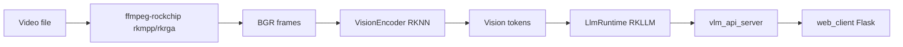

# video-descriptor-rkllm

[](https://github.com/ShiWarai/video-descriptor-rkllm/actions/workflows/deploy.yml)
[](LICENSE)


Описание видео на **Rockchip RK3588 NPU**: Qwen3.5-VL (RKNN + RKLLM), аппаратный декод через **ffmpeg-rockchip**, OpenAI-compatible HTTP API и Flask web UI.

## Оглавление

| Раздел | Содержание |
|--------|------------|
| [Быстрый старт](#быстрый-старт) | Docker Compose на RK3588 |
| [Требования](#требования) | Железо, драйверы, модели |
| [Архитектура](#архитектура) | Пайплайн video → API |
| [HTTP API](#http-api) | Эндпоинты |
| [CLI](#cli) | Локальный запуск |
| [Конфигурация](#конфигурация) | `config.json` |
| [Модели](#модели) | HF, автоподгрузка |
| [Сборка из исходников](#сборка-из-исходников) | CMake, тесты |
| [CI/CD](#cicd) | GHCR `:main` / `:prerelease` |
| [Атрибуция](#атрибуция) | Upstream |
| [Лицензия](#лицензия) | BSD 3-Clause |

---

## Быстрый старт

На плате RK3588 (arm64):

```bash
git clone https://github.com/ShiWarai/video-descriptor-rkllm.git
cd video-descriptor-rkllm

# Положите веса в `./models` или скачайте только 0.8B при старте:
VLM_DOWNLOAD_MODELS=0.8b docker compose up -d --build
```

- **API:** http://localhost:8080 (`/health`, `/v1/models`, `/v1/video/analyze`)
- **Web UI:** http://localhost:5000

Продакшен (образы из GHCR):

```bash
docker compose -f docker-compose.yml -f docker-compose.prod.yml pull
docker compose -f docker-compose.yml -f docker-compose.prod.yml up -d
```

Prerelease:

```bash
docker compose -f docker-compose.yml -f docker-compose.prerelease.yml pull
docker compose -f docker-compose.yml -f docker-compose.prerelease.yml up -d
```

---

## Требования

| Компонент | Версия / примечание |
|-----------|---------------------|
| SoC | Rockchip **RK3588 / RK3588S** |
| OS | Ubuntu 22.04 / 24.04 arm64 |
| NPU | RKNPU2 driver, устройства `/dev/mpp_service`, `/dev/rga`, `/dev/dri`, `/dev/dma_heap` |
| Runtime | RKLLM 1.3.0+, RKNN (в `third_party/lib`) |
| ffmpeg | vendored **ffmpeg-rockchip** (`third_party/ffmpeg-rockchip/`) |
| Модели | не в git — volume `./models` или `VLM_DOWNLOAD_MODELS=1` |

---

## Архитектура



Сервис: видео → кадры (ffmpeg-rockchip) → vision encoder (RKNN) → multimodal LLM (RKLLM) → **description** + **transcript** (stub / внешний ASR).

---

## HTTP API

### Статус

```bash
curl -s http://localhost:8080/health
curl -s http://localhost:8080/v1/status | jq
```

### `POST /v1/video/analyze` (multipart)

```bash
curl -s http://localhost:8080/v1/video/analyze \
  -F "file=@test_video.mp4" \
  -F "model=qwen3.5-0.8b-video" \
  -F "frames=8" \
  -F "frame_budget=28" \
  -F "lang=ru" | jq
```

### `POST /v1/chat/completions` (OpenAI-compatible + `video_url`)

```bash
curl -s http://localhost:8080/v1/chat/completions \
  -H 'Content-Type: application/json' \
  -d '{
    "model": "qwen3.5-0.8b-video",
    "messages": [{
      "role": "user",
      "content": [
        {"type": "video_url", "video_url": {"url": "file:///app/test_video.mp4"}}
      ]
    }],
    "extra_body": {"frames": 8, "frame_budget": 28, "lang": "ru"}
  }' | jq
```

### `GET /v1/models`

Список моделей из `config.json` (без alias в ответе).

---

## CLI

```bash
LD_LIBRARY_PATH=./third_party/lib:./third_party/ffmpeg-rockchip/lib \
  ./build/VLM_VIDEO_NPU \
  models/qwen3.5-0.8b_vision_rk3588.rknn \
  models/qwen3.5-0.8b_w8a8_rk3588.rkllm \
  test_video.mp4 --context 8192 --frames 20 --verbose
```

---

## Конфигурация

Пример: [`config.example.json`](config.example.json). Основные поля:

| Поле | Описание |
|------|----------|
| `models[]` | id, пути к `.rknn` / `.rkllm`, sampling overrides |
| `default_model` | модель по умолчанию |
| `preload_model` | загрузить на старте (опционально) |
| `pipeline.frame_budget` | потолок кадров (28 по умолчанию) |
| `pipeline.ffmpeg_bin_path` | `third_party/ffmpeg-rockchip/bin` |

Логи — в **stderr**. Детали RKNN/RKLLM: `"verbose": true` в `pipeline` или `--verbose`.

---

## Модели

Веса **не** в git. Каталог `./models` на хосте создаётся при `docker compose up` (volume `./models` → `/app/models`).

| Модель | Vision (RKNN) | LLM (RKLLM) | Hugging Face |
|--------|---------------|-------------|--------------|
| Qwen3.5-0.8B | `qwen3.5-0.8b_vision_rk3588.rknn` | `qwen3.5-0.8b_w8a8_rk3588.rkllm` | [HF](https://huggingface.co/Qengineering/Qwen3.5-0.8B-rk3588) |
| Qwen3.5-2B | `qwen3.5-2b_vision_rk3588.rknn` | `qwen3.5-2b_w8a8_rk3588.rkllm` | [HF](https://huggingface.co/Qengineering/Qwen3.5-2B-rk3588) |

**Автоподгрузка (opt-in):** `VLM_DOWNLOAD_MODELS=0.8b` (или `2b`, `all`, `0.8b,2b`). Свои URL: `VLM_MODEL_URLS=имя_файла=https://...`

| `VLM_DOWNLOAD_MODELS` | Что качается |
|-----------------------|--------------|
| `0` / не задано | ничего |
| `0.8b` | только 0.8B |
| `2b` | только 2B |
| `all` / `1` | обе |

```bash
VLM_DOWNLOAD_MODELS=0.8b docker compose up -d api
```

Ручная загрузка:

```bash
MODELS_DIR=./models ./scripts/download_models.sh 0.8b
```

---

## Сборка из исходников

```bash
mkdir -p build && cd build
cmake ..
make -j$(nproc)
ctest --output-on-failure
```

Или unit-тесты в Docker (как в CI, без NPU/моделей):

```bash
docker compose -f docker-compose.dev.yml build
docker compose -f docker-compose.dev.yml run --rm test
```

Артефакты: `build/vlm_api_server`, `build/VLM_VIDEO_NPU`.

```bash
LD_LIBRARY_PATH=./third_party/lib:./third_party/ffmpeg-rockchip/lib \
  ./build/vlm_api_server --config config.json
```

### Структура проекта

```
include/              публичные заголовки
src/                  реализация C++
third_party/
  lib/                librkllmrt.so, librknnrt.so
  ffmpeg-rockchip/    vendored ffmpeg + Rockchip libs
  rkllm/              C API headers
scripts/              download_models.sh, docker-entrypoint.sh
web_client/           Flask UI
models/               веса (volume mount)
```

---

## CI/CD

| Workflow | Триггер | Результат |
|----------|---------|-----------|
| **Deploy** | push `main` / `dev` | `docker-compose.dev.yml` → build + `ctest` (`ubuntu-24.04-arm`) |
| **Deploy → prerelease** | push `dev` с `[prerelease]` или manual `publish_prerelease` | `ghcr.io/shiwarai/video-descriptor-rkllm:prerelease` (+ web) |
| **Publish** | успешный Deploy на `main` | `:main` и `:${sha}` |

Образы: **linux/arm64 only**.

```bash
# Prerelease из dev
git commit -m "feat: ... [prerelease]"
git push origin dev
```

GHCR:
- `ghcr.io/shiwarai/video-descriptor-rkllm:main`
- `ghcr.io/shiwarai/video-descriptor-rkllm-web:main`

---

## Атрибуция

- [Qengineering](https://github.com/Qengineering) — Qwen3.5 RK3588 models and reference NPU demos
- [nyanmisaka/ffmpeg-rockchip](https://github.com/nyanmisaka/ffmpeg-rockchip) — hardware video decode (rkmpp/rkrga)
- Rockchip RKLLM / RKNN runtimes

---

## Лицензия

BSD 3-Clause — см. [LICENSE](LICENSE)

_Проект создан с использованием нейросетей._